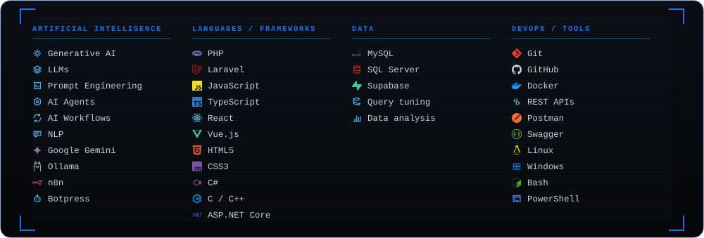
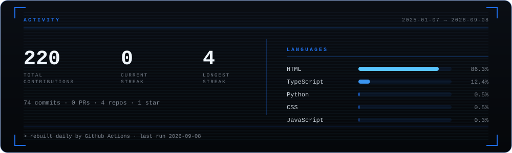

  
  &nbsp;
  
  &nbsp;
  

## About

I'm an AI Engineer and Software Engineer based in São Paulo, Brazil. I build intelligent
systems that sit inside real business processes — AI agents, document validation, and
automation pipelines that replace manual work instead of just demoing well.

Most of my day is spent between Laravel on the backend, n8n orchestrating the automation
layer, and MySQL underneath. I studied Systems Analysis and Development at FAM.

## Stack

## Featured projects

| Project | What it does |
| :-- | :-- |
| [**SuperGestão**](https://github.com/Erickaocode/APP_SUPER_GESTAO) | Business management system built with Laravel |
| [**DEP Company**](https://github.com/Erickaocode/DEP-COMPANY) | Corporate web project |
| [**Portfolio**](https://github.com/Erickaocode/Portfolio) | My personal portfolio |
| **Intelligent Document Validation** | AI-driven document validation for onboarding flows |
| **Biblioteca IA** | Internal library of AI resources and prompts |

 

---

<i>Always learning, building and shipping.</i>
